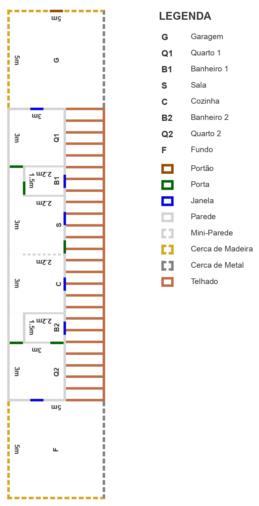

# aplicacoes-para-internet-t3

Olá, aluno(a),

Você foi contratado para desenvolver uma planta baixa baseada no layout abaixo. Esta planta tem como referência um terreno de dimensão 5x25. Assim sendo, para manter a proporção utilize a escala 1:5.

Para esta atividade seus conhecimentos de CSS em bordas e posicionamentos serão testados! Está preparado?

Para ajudá-lo(s) indico os seguintes materiais:

  - CSS border property: [MDN](https://developer.mozilla.org/en-US/docs/Web/CSS/border) | [W3Schools](https://www.w3schools.com/css/css_border.asp)
  - CSS position property: [MDN](https://developer.mozilla.org/pt-BR/docs/Web/CSS/position) | [W3Schools](https://www.w3schools.com/css/css_positioning.asp)

**Nota:** Deves utilizar apenas HTML e CSS e nenhuma outra tecnologia!

Lembrem-se que esta atividade não é pontuada, no entanto, muito importante para o desenvolvimento do conhecimento sobre o assunto.

Este fórum estará aberto, entre os dias: DD/MM à DD/MM.

Vamos lá!
